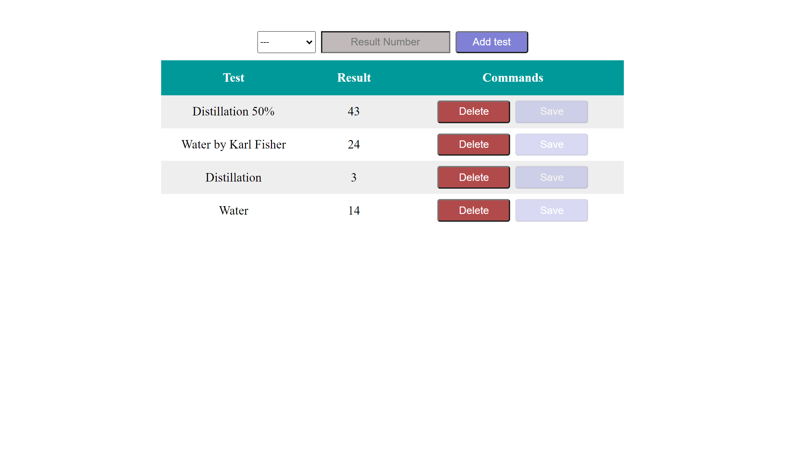

## Used technologies
    - Vanilla JS
    - OOP
    - JS Custom elements
    - JSDoc

### Screenshots

 A Vanilla.js SPA for a presentation html murkuped slides.

 ## Installation instruction
    You must clone the repo:
     git clone https://github.com/rryaboshtan/PresentationTool.git

     And input in the command line
      npm i            

    After that you must install http-server globally
     npm i -g http-server

    Then type in the VSCode or other command line 
     npx http-server
    and go to proposed link (it may be 127.0.0.1:8080 in the browser) 
